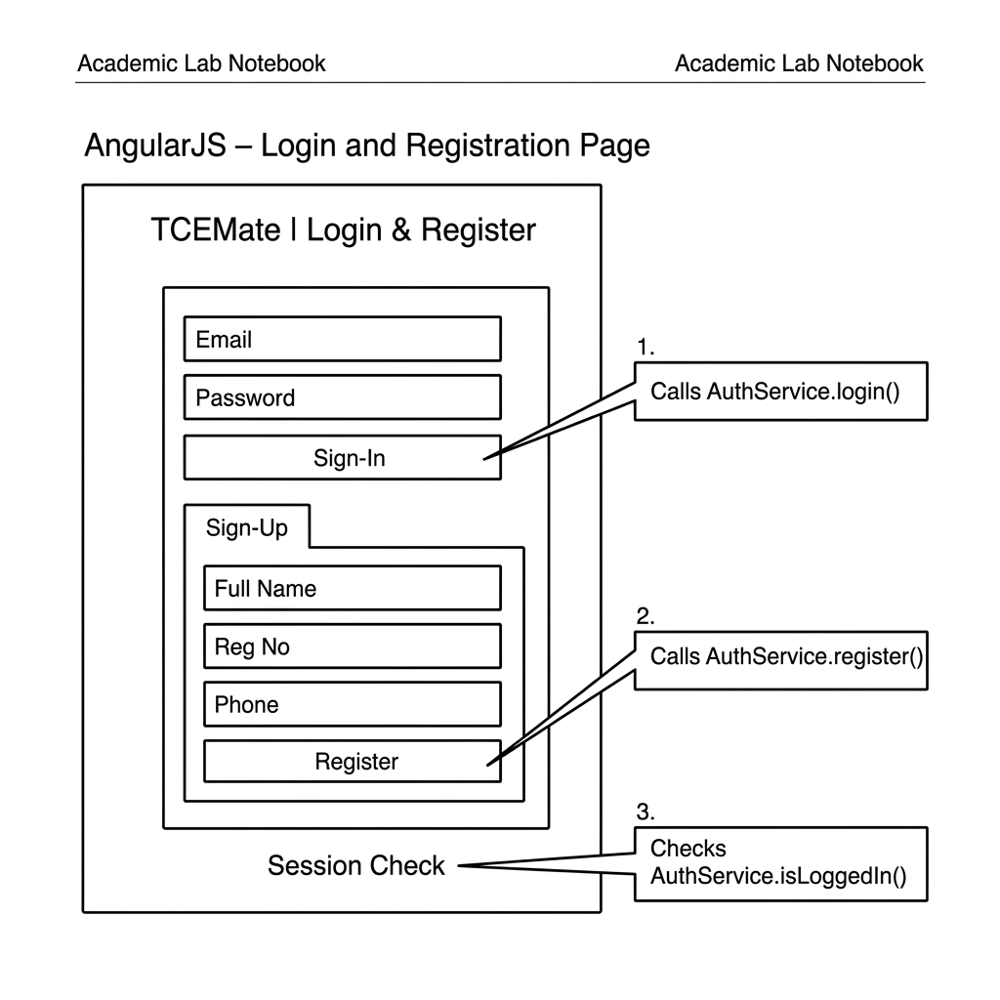
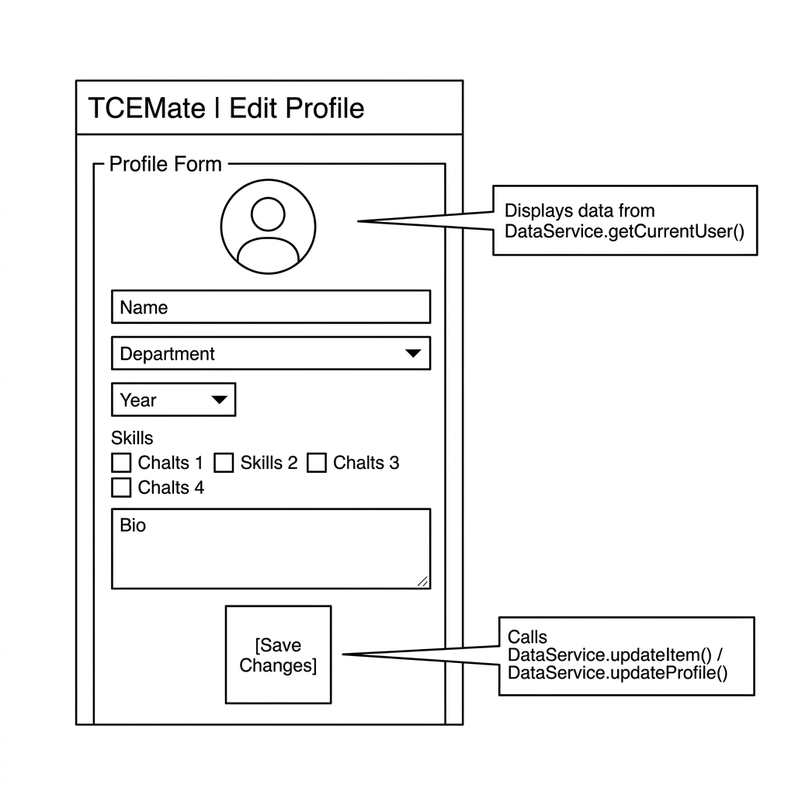
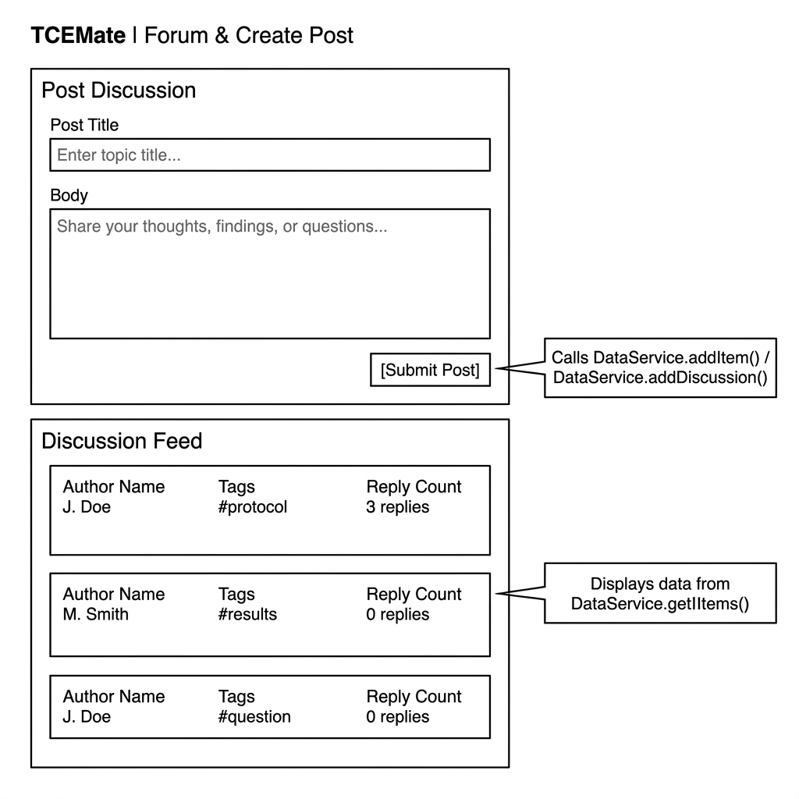
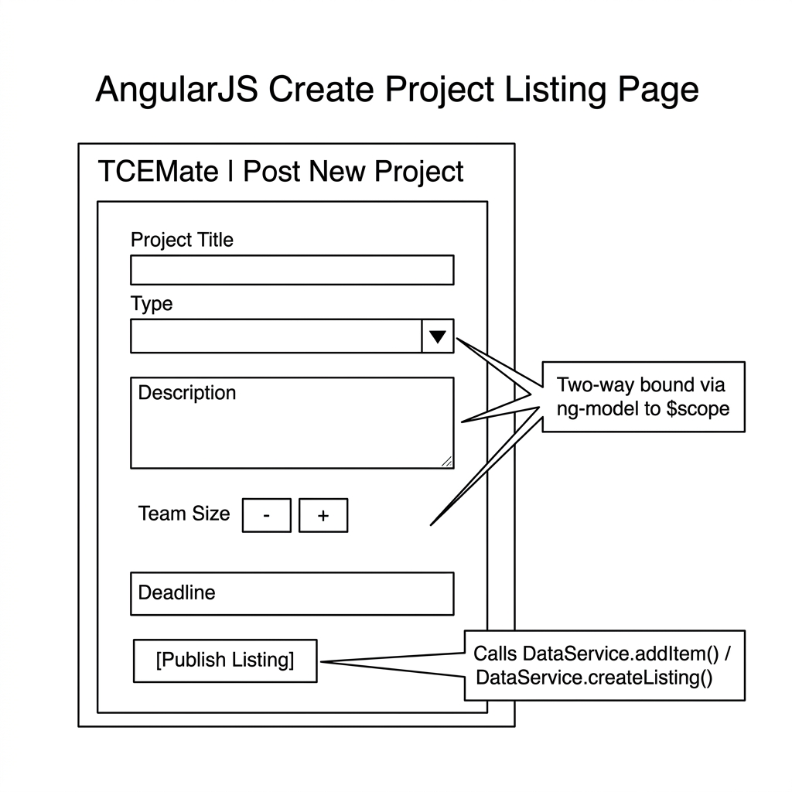
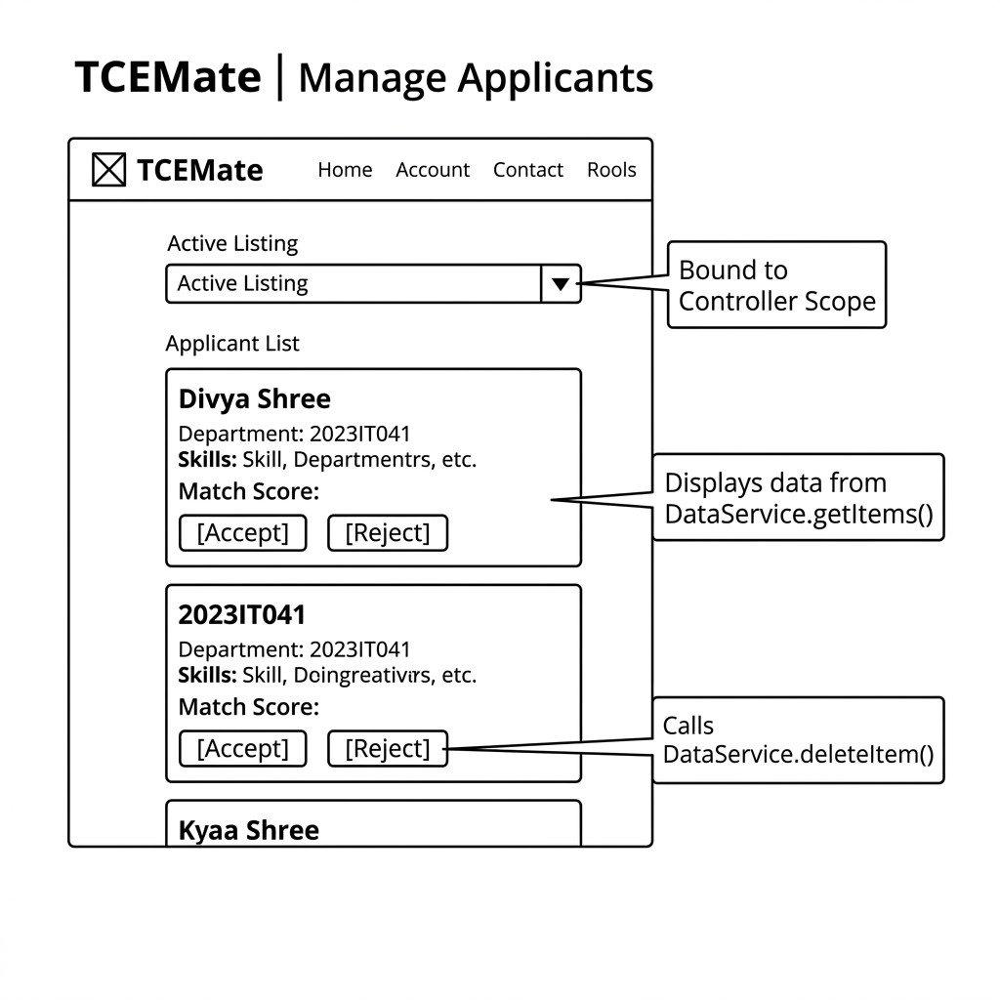
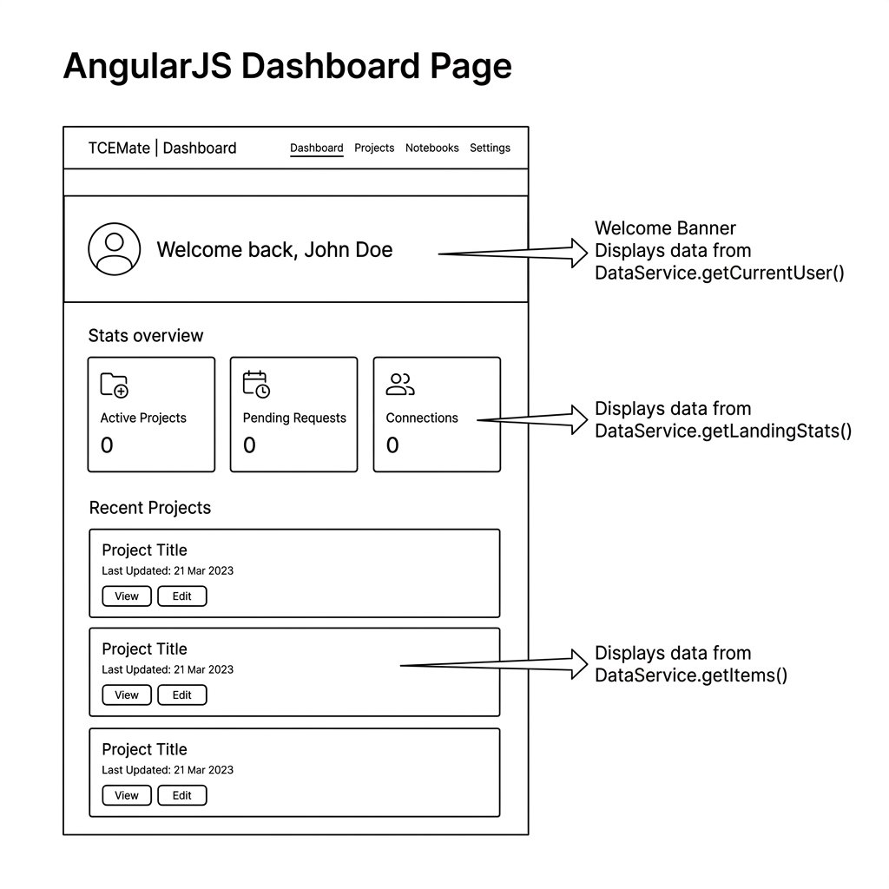
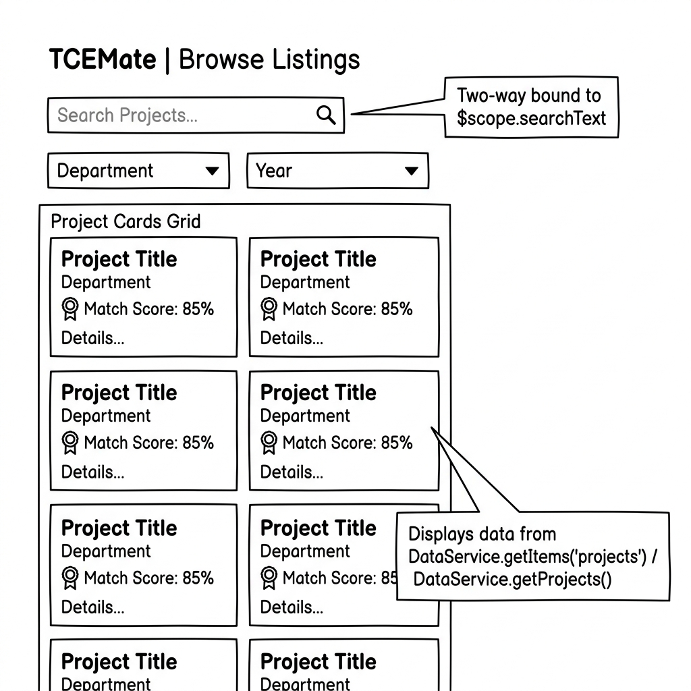
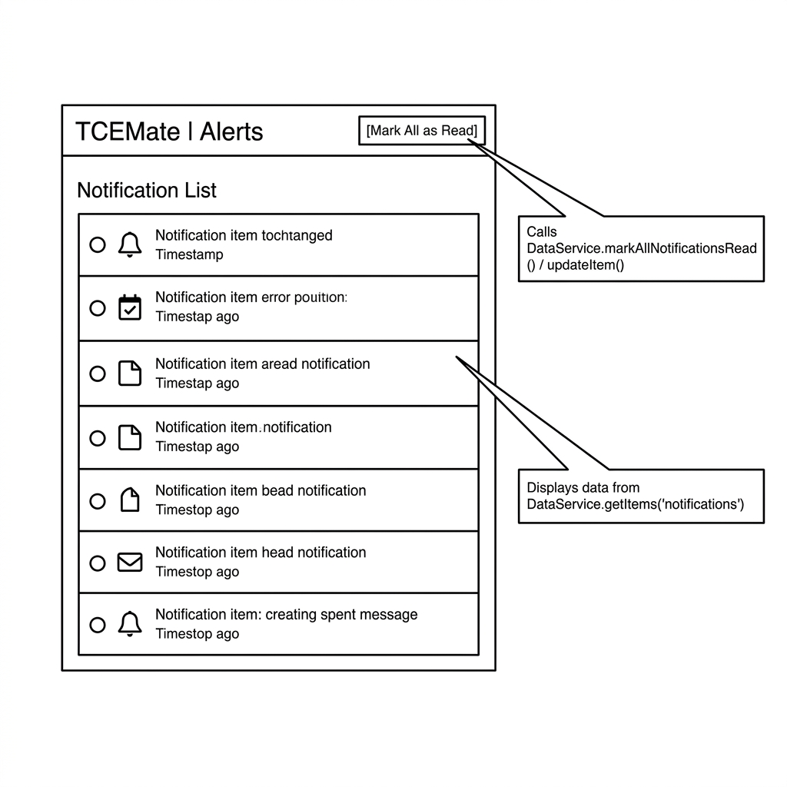
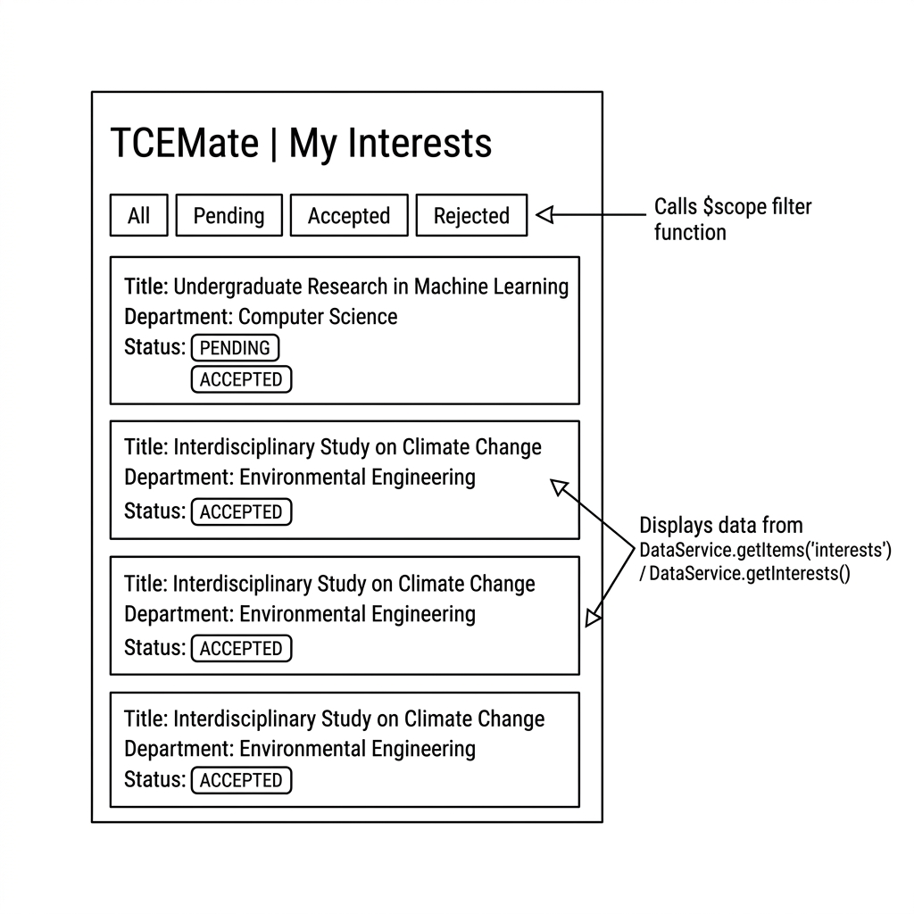
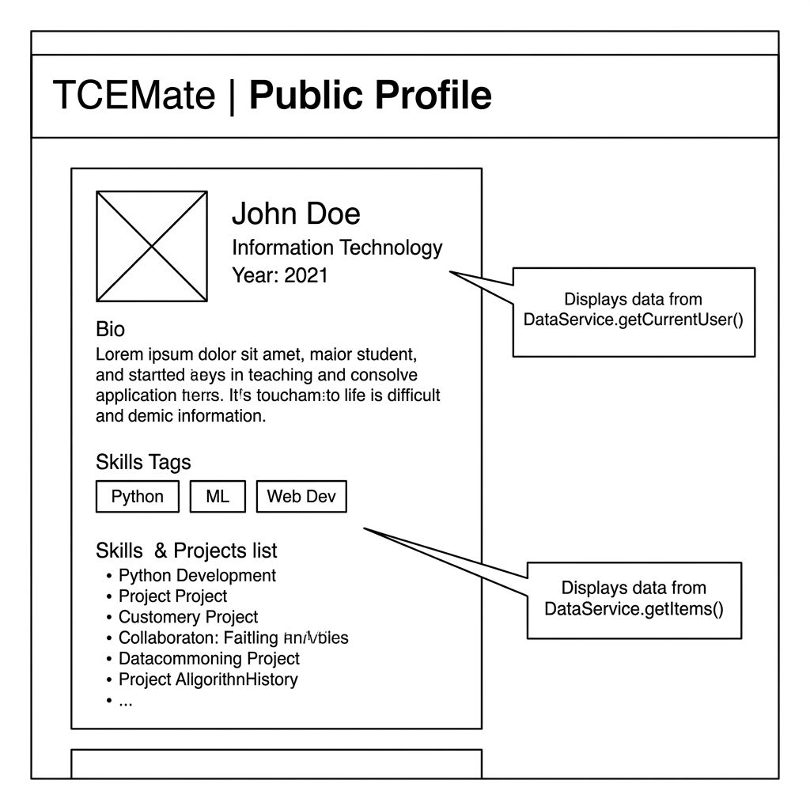

# TCEMate — AngularJS Factory Refactoring & UI Wireframe Report

**Course**: Web Technology Lab  
**Project**: TCEMate Team Collaboration Portal  
**Framework**: AngularJS (v1.8.3)  

---

## 1. AngularJS Service vs. Factory Architecture Comparison

| Feature | AngularJS Service (`.service()`) | AngularJS Factory (`.factory()`) |
| :--- | :--- | :--- |
| **Instantiation** | Constructor instantiated using `new` operator. | Invoked as a standard function returning an API object. |
| **Method Binding** | Binds properties directly to `this` (e.g., `this.getItems = ...`). | Returns a JavaScript object literal exposing public functions. |
| **Encapsulation** | State accessible via constructor properties. | Enables private variables and functions via closure scope. |
| **Lab Requirement** | Not recommended for strict closure pattern. | **Mandatory** (Returns explicit object exposure without `this`). |

---

## 2. Core Factory Data Manipulation Functions

Both `DataService` and `AuthService` are implemented as **AngularJS Factories** exposing core CRUD logic:

```javascript
// DataService Factory API Signature (js/data.js)
return {
  getItems: getItems,       // Reads category records
  addItem: addItem,         // Inserts a new record with timestamp ID
  deleteItem: deleteItem,   // Removes a record by ID using Array.prototype.filter
  updateItem: updateItem    // Updates an existing record using Array.prototype.map
};
```

---

## 3. Page-by-Page Factory & Wireframe Mapping

### Page 1: Login & Registration (`login.html`)
* **Wireframe**: 
* **Controller**: `LoginController`
* **Injected Factory**: `AuthService`
* **Factory Functions Used**: `AuthService.login()`, `AuthService.register()`, `AuthService.isLoggedIn()`

#### Code Snippet:
```javascript
// FACTORY DEFINITION (js/auth.js)
angular.module('tcemate').factory('AuthService', function () {
  return {
    login: function (email, password) {
      sessionStorage.setItem('loggedIn', 'true');
      return { ok: true, message: 'Login successful!' };
    },
    register: function (data) {
      sessionStorage.setItem('loggedIn', 'true');
      return { ok: true, message: 'Account created!' };
    }
  };
});

// CONTROLLER USAGE (js/app.js)
app.controller('LoginController', ['AuthService', '$window', function (AuthService, $window) {
  var vm = this;
  vm.login = function () {
    var result = AuthService.login(vm.loginData.email, vm.loginData.password);
    if (result.ok) $window.location.href = 'index.html';
  };
}]);
```

---

### Page 2: Edit Profile (`profile.html`)
* **Wireframe**: 
* **Controller**: `ProfileController`
* **Injected Factory**: `DataService`
* **Factory Functions Used**: `DataService.getCurrentUser()`, `DataService.updateProfile()` / `DataService.updateItem()`

#### Code Snippet:
```javascript
// FACTORY DEFINITION (js/data.js)
function updateItem(category, id, data) {
  state[category] = state[category].map(function (item) {
    return item.id === id ? Object.assign({}, item, data) : item;
  });
  saveState(state);
  return getItems(category);
}

// CONTROLLER USAGE (js/app.js)
app.controller('ProfileController', ['DataService', function (DataService) {
  var vm = this;
  vm.profile = DataService.getCurrentUser();

  vm.saveProfile = function () {
    DataService.updateProfile(vm.profile);
    alert('Profile updated!');
  };
}]);
```

---

### Page 3: Forum & Create Post (`create-post.html` & `forum.html`)
* **Wireframe**: 
* **Controllers**: `CreatePostController`, `ForumController`
* **Injected Factory**: `DataService`
* **Factory Functions Used**: `DataService.addDiscussion()` / `DataService.addItem()`, `DataService.getDiscussions()` / `DataService.getItems()`

#### Code Snippet:
```javascript
// FACTORY DEFINITION (js/data.js)
function addItem(category, item) {
  var newItem = Object.assign({ id: Date.now() }, item);
  state[category].unshift(newItem);
  saveState(state);
  return newItem;
}

// CONTROLLER USAGE (js/app.js)
app.controller('CreatePostController', ['DataService', function (DataService) {
  var vm = this;
  vm.submitPost = function () {
    DataService.addDiscussion(vm.post);
    vm.post = { title: '', body: '' };
  };
}]);
```

---

### Page 4: Create Project Listing (`create-listing.html`)
* **Wireframe**: 
* **Controller**: `CreateListingController`
* **Injected Factory**: `DataService`
* **Factory Functions Used**: `DataService.createListing()` / `DataService.addItem()`

#### Code Snippet:
```javascript
// CONTROLLER USAGE (js/app.js)
app.controller('CreateListingController', ['DataService', function (DataService) {
  var vm = this;
  vm.listing = { title: '', description: '', department: 'Information Technology' };

  vm.submitListing = function () {
    DataService.createListing(vm.listing, vm.teamSize);
    alert('Listing published!');
  };
}]);
```

---

### Page 5: Manage Applicants (`manage-applicants.html`)
* **Wireframe**: 
* **Controller**: `ApplicantsController`
* **Injected Factory**: `DataService`
* **Factory Functions Used**: `DataService.getApplicants()`, `DataService.removeApplicant()` / `DataService.deleteItem()`

#### Code Snippet:
```javascript
// FACTORY DEFINITION (js/data.js)
function deleteItem(category, id) {
  state[category] = state[category].filter(function (item) { return item.id !== id; });
  saveState(state);
  return state[category];
}

// CONTROLLER USAGE (js/app.js)
app.controller('ApplicantsController', ['DataService', function (DataService) {
  var vm = this;
  vm.applicants = DataService.getApplicants();

  vm.handleApplicant = function (applicant) {
    vm.applicants = DataService.removeApplicant(applicant.id);
  };
}]);
```

---

### Page 6: Dashboard (`index.html`)
* **Wireframe**: 
* **Controller**: `LandingController`
* **Injected Factory**: `DataService`, `AuthService`
* **Factory Functions Used**: `DataService.getCurrentUser()`, `DataService.getLandingStats()`, `DataService.getProjects()`

#### Code Snippet:
```javascript
// CONTROLLER USAGE (js/app.js)
app.controller('LandingController', ['DataService', 'AuthService', function (DataService, AuthService) {
  var vm = this;
  vm.user = DataService.getCurrentUser();
  vm.stats = DataService.getLandingStats();
  vm.projects = DataService.getProjects().slice(0, 2);
}]);
```

---

### Page 7: Browse Project Listings (`browse.html`)
* **Wireframe**: 
* **Controller**: `ProjectsController`
* **Injected Factory**: `DataService`
* **Factory Functions Used**: `DataService.getProjects()` / `DataService.getItems('projects')`

#### Code Snippet:
```javascript
// CONTROLLER USAGE (js/app.js)
app.controller('ProjectsController', ['DataService', function (DataService) {
  var vm = this;
  vm.projects = DataService.getProjects();
}]);
```

---

### Page 8: Alerts & Notifications (`notifications.html`)
* **Wireframe**: 
* **Controller**: `NotificationsController`
* **Injected Factory**: `DataService`
* **Factory Functions Used**: `DataService.getNotifications()`, `DataService.markAllNotificationsRead()`

#### Code Snippet:
```javascript
// CONTROLLER USAGE (js/app.js)
app.controller('NotificationsController', ['DataService', function (DataService) {
  var vm = this;
  vm.notifications = DataService.getNotifications();

  vm.markAllRead = function () {
    vm.notifications = DataService.markAllNotificationsRead();
  };
}]);
```

---

### Page 9: My Interests (`my-interests.html`)
* **Wireframe**: 
* **Controller**: `InterestsController`
* **Injected Factory**: `DataService`
* **Factory Functions Used**: `DataService.getInterests()` / `DataService.getItems('interests')`

#### Code Snippet:
```javascript
// CONTROLLER USAGE (js/app.js)
app.controller('InterestsController', ['DataService', function (DataService) {
  var vm = this;
  vm.interests = DataService.getInterests();
}]);
```

---

### Page 10: View Public Profile (`profile-view.html`)
* **Wireframe**: 
* **Controller**: `ProfileController`
* **Injected Factory**: `DataService`
* **Factory Functions Used**: `DataService.getCurrentUser()`

#### Code Snippet:
```javascript
// CONTROLLER USAGE (js/app.js)
app.controller('ProfileController', ['DataService', function (DataService) {
  var vm = this;
  vm.profile = DataService.getCurrentUser();
}]);
```

---

## 4. Git Repository & Remote Status
All code changes and observation records have been committed and synced to GitHub:
* **Remote Repository**: `https://github.com/SANPRIYAN/TCEMate-Team-Collaboration-Portal.git`
* **Main Branch Status**: Up to date (`origin/main`).

---

## 5. Final AngularJS Concept Implementation Matrix

| Page / Feature | DI | Factory | Custom Directive | Animation | ngMessages | Minification ($inject) |
| :--- | :---: | :---: | :---: | :---: | :---: | :---: |
| **Page 1: Login & Register (`login.html`)** | ✓ | ✓ | `auth-branding-header` | ✓ (`ng-hide`/`ng-show`) | ✓ | ✓ |
| **Page 2: Dashboard (`index.html`)** | ✓ | ✓ | `stat-card-widget`, `project-card-item` | ✓ (`ng-repeat`) | N/A | ✓ |
| **Page 3: Browse (`browse.html`)** | ✓ | ✓ | `project-card-item` | ✓ (`ng-repeat` filter) | N/A | ✓ |
| **Page 4: Forum (`forum.html`)** | ✓ | ✓ | `forum-thread-card` | ✓ (`ng-repeat`) | N/A | ✓ |
| **Page 5: Create Post (`create-post.html`)** | ✓ | ✓ | `post-preview-card` | ✓ (`ng-messages` / `ng-if`) | ✓ | ✓ |
| **Page 6: Create Listing (`create-listing.html`)** | ✓ | ✓ | `listing-preview-card` | ✓ (`ng-messages` / `ng-if`) | ✓ | ✓ |
| **Page 7: Manage Applicants (`manage-applicants.html`)** | ✓ | ✓ | `applicant-row-card` | ✓ (`ng-repeat` leave) | N/A | ✓ |
| **Page 8: My Interests (`my-interests.html`)** | ✓ | ✓ | `interest-row-item` | ✓ (`ng-repeat` tab) | N/A | ✓ |
| **Page 9: Alerts & Notifications (`notifications.html`)** | ✓ | ✓ | `notification-item-card` | ✓ (`ng-repeat`) | N/A | ✓ |
| **Page 10: View Profile (`profile-view.html`)** | ✓ | ✓ | `portfolio-project-card` | ✓ (`ng-repeat`) | N/A | ✓ |
| **Page 11: Edit Profile (`profile.html`)** | ✓ | ✓ | `skill-badge-list` | ✓ (`ng-messages` / `ng-if`) | ✓ | ✓ |

